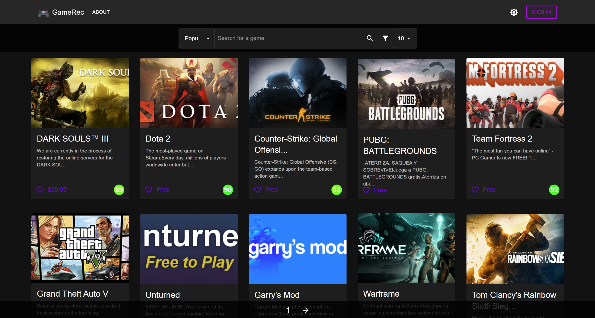
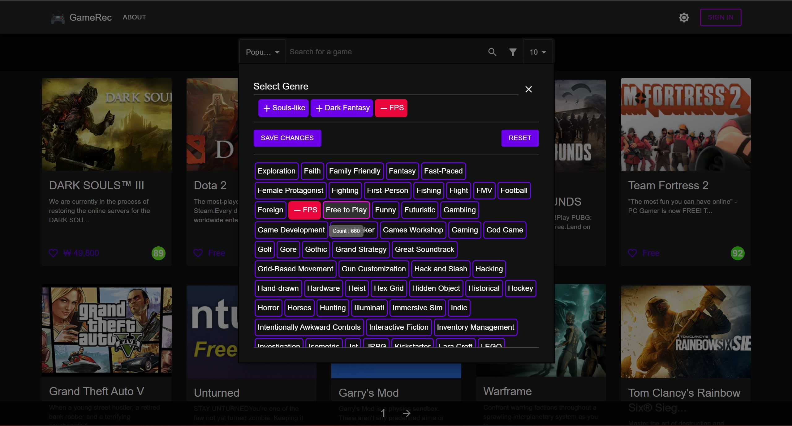
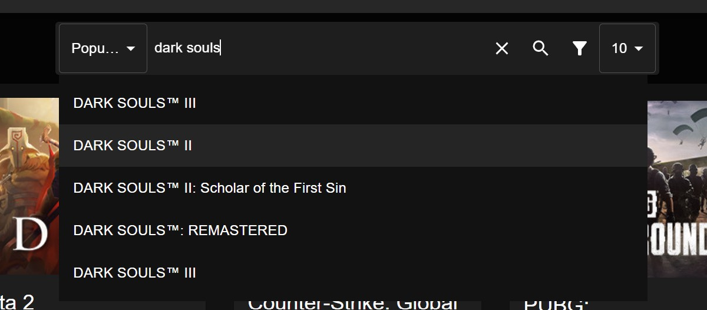
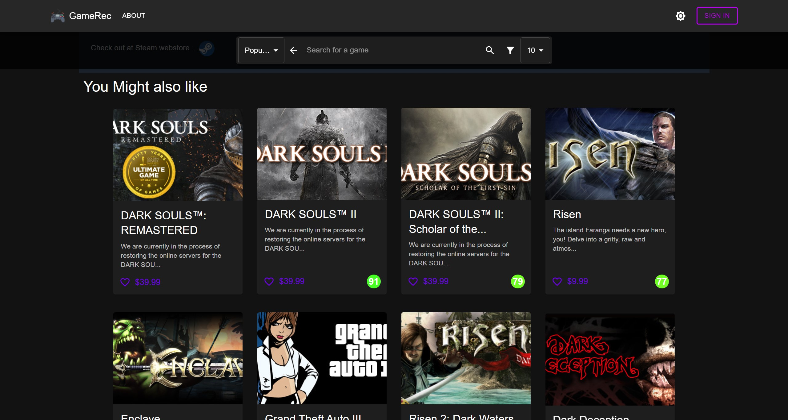

# Game Recommendation Engine

## Live Demo : https://lambent-rabanadas-eb6098.netlify.app/
(It is still under development)

## Screenshots
### Home


### Filter


### Search


### Recommendation


### TechStack
- Python
- React
- NodeJS
- Material UI

### Installation

**Client**

Within the client folder

```
npm install
npm start
```

**API**
(Yet to be uploaded)

Within the api folder

```
pip install -r requirements.txt
```
then run ```main.py```

## Authors

- [@USharma002](https://github.com/USharma002)
